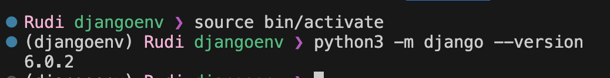
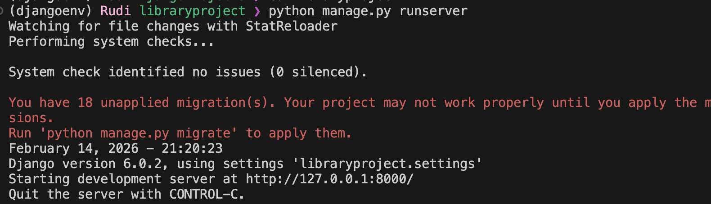
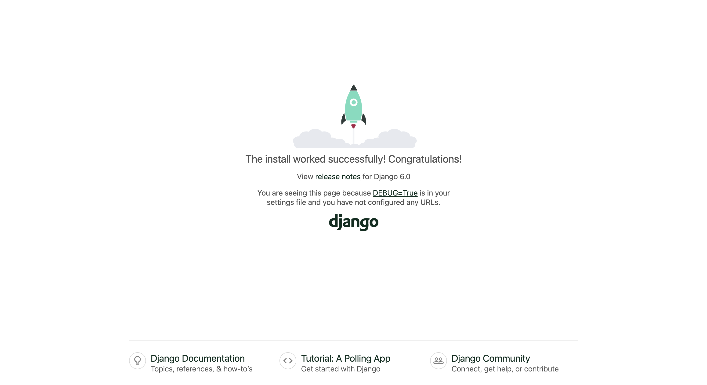
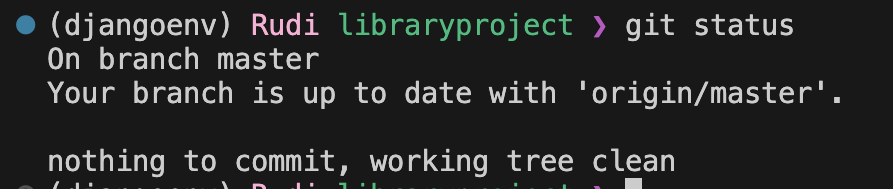

# CS471 - Lab 2
Rudi Aleidan

## Part 1: Django

### Task 1: Installing Django

Successfully installed Django and created a project & created a virtual environment for the project.



### Task 2: Creating a Django Project

Successfully created a Django project and ran the development server.





### Task 3: Configure the Application

in ```settings.py``` file, added the application to the ``INSTALLED_APPS`` list.

```python
INSTALLED_APPS = [
    // ...
    'apps.bookmodule',
    'apps.usermodule',
]
```

## Part 2: Git

### Task 1: Local git repository

Initialized a local git repository, added files, and made commits.



### Task 2: Remote git repository

Created a remote repository on GitHub and pushed the local repository to GitHub.